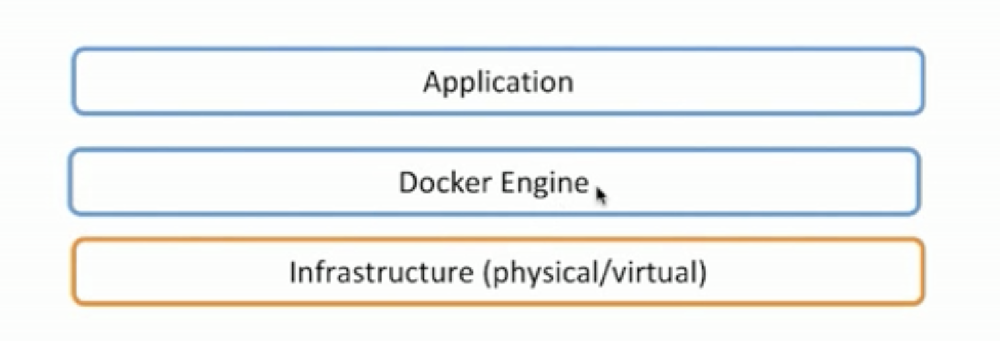
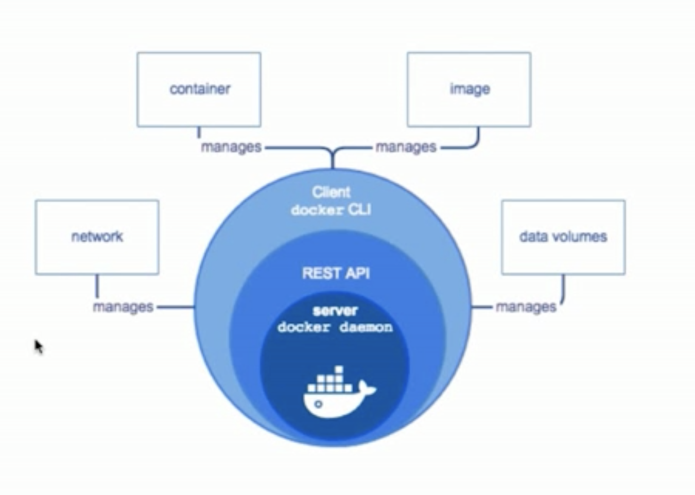
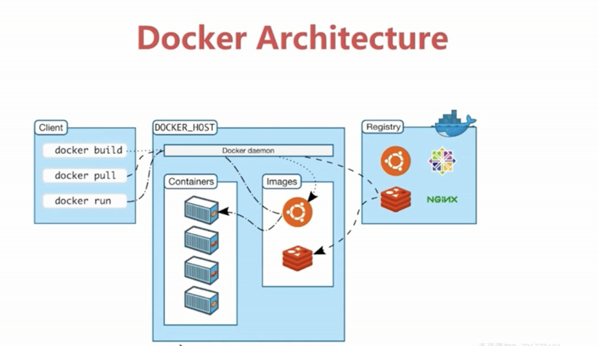

# 深入系统 docker 学习

## 安装

### macos 安装 docker

- 使用 Homebrew 安装
  ```
    brew -v
    sudo brew update
    brew cask install update
  ```

* 手动下载安装
  官网下载即可`https://docs.docker.com/docker-for-mac/install/`

### centos 安装 docker

- 搭建 centos 虚拟机
  - 下载`virtualbox`, 地址`https://www.virtualbox.org/wiki/Downloads`
  * 下载`vagrant`, 地址`https://www.vagrantup.com/downloads.html`

* 基于 vagrant 构建

  ```
    vagrant init centos/7
    vagrant up
    vagrant ssh
    sudo yum update
    exit
    vagrant status
    vagrant halt
    vagrant destroy
  ```

* 在 centos 上安装 docker

  ```
    $ sudo yum remove docker docker-client docker-client-latest docker-common docker-latest docker-latest-logrotate docker-logrotate docker-engine

    $ sudo yum install -y yum-utils device-mapper-persistent-data lvm2

    $ sudo yum-config-manager --add-repo https://download.docker.com/linux/centos/docker-ce.repo

    $ sudo yum install docker-ce docker-ce-cli containerd.io

    $ sudo systemctl start docker

    $ sudo docker run hello-world

  ```

## docker machine

- 使用 docker-machine 创建 virtualbox 虚拟机

  ```
    docker-machine version
    docker-machine create demo
    docker-machine ls
    docker-machine ssh demo
    docker-machine stop demo
    docker-machine env demo
    eval $(docker-machine env demo)
  ```

- 让 docker-machine 和阿里云搞 cp
  参考`https://github.com/AliyunContainerService/docker-machine-driver-aliyunecs`

## docker 底层

### docker platform

- docker 提供了一个开发，打包，运行 app 的平台
- 把 app 和底层 infrastructure 隔离开来



### docker engine

- 后台进程(dockerd)

- REST API Server

- CLI 接口(docker)



### docker architecture



### 底层技术支持

- Namespaces: 做隔离 pid,net,ipc,mnt,uts

* Control groups: 做资源限制

* Union file systems: Container 和 image 的分层

## docker image

- 操作系统分为内核和用户空间。对于 Linux 而言，内核启动后，会挂载 root 文件系统为其提供用户空间支持。而 Docker 镜像（Image），就相当于是一个 root 文件系统。
- Docker 镜像是一个特殊的文件系统，除了提供容器运行时所需的程序、库、资源、配置等文件外，还包含了一些为运行时准备的一些配置参数（如匿名卷、环境变量、用户等）。 镜像不包含任何动态数据，其内容在构建之后也不会被改变。
- Docker 设计时，就充分利用 Union FS 的技术，将其设计为 分层存储的架构 。 镜像实际是由多层文件系统联合组成。
- 镜像构建时，会一层层构建，前一层是后一层的基础。每一层构建完就不会再发生改变，后一层上的任何改变只发生在自己这一层。

## docker container

## docker 常用指令

### 镜像操作

| 功能               | 命令                                          |
| ------------------ | :-------------------------------------------- |
| 拉取镜像           | docker pull [镜像名称:版本]                   |
| 镜像列表           | docker images                                 |
| 删除镜像           | docker rmi[镜像名称:版本]                     |
| 镜像操作记录       | docker history [镜像名称:版本]                |
| 给镜像设置新的仓库 | docker tag [镜像名称:版本][新镜像名称:新版本] |
| 查看镜像详细       | docker inspect [镜像名称:版本]                |
| 搜索镜像           | docker search [关键字]                        |
| 仓库登录           | docker login                                  |

### 容器操作

| 功能                  | 命令                                                                        |
| --------------------- | :-------------------------------------------------------------------------- |
| 启动容器并进入        | docker run -ti --name [容器名称][镜像名称:版本] bash                        |
| 容器列表              | docker ps -a                                                                |
| 容器提交为新的镜像    | docker commit [容器名称] my_image:v1.0                                      |
| 容器后台运行          | docker run -d --name [容器名称][镜像名称:版本] bash -c "echo hello world"   |
| 容器结束后自动删除    | docker run --rm --name [容器名称][镜像名称:版本] bash -c "echo hello world" |
| 删除容器              | docker rm [容器名称]                                                        |
| 进入容器 exec         | docker exec -ti [容器名称] bash                                             |
| 进入容器 attach       | docker attach [容器名称]                                                    |
| 停止容器              | docker stop [容器名称]                                                      |
| Docker 日志           | docker logs [容器名称]                                                      |
| 查看容器详细          | docker inspect [容器名称]                                                   |
| 查看容器最近一个进程  | docker top [容器名称]                                                       |
| docker top [容器名称] | docker restart [容器名称]                                                   |
| 暂停一个容器进程      | docker pause [容器名称]                                                     |
| 取消暂停              | docker unpause [容器名称]                                                   |
| 终止容器              | docker kill [容器名称]                                                      |
| 端口映射              | docker run -ti --name [容器名称] -p 8080:80 [镜像名称:版本] bash            |

### 内存限制

| 参数          | 简介                                                      |
| ------------- | :-------------------------------------------------------- |
| -m, - -memory | 内存限制，格式：数字+单位，单位可以是 b, k, m, g，最小 4M |

### CPU 限制

| 参数               | 简介              |
| ------------------ | :---------------- |
| -- -cpuset-cpus="" | 允许使用的 CPU 集 |
| -c,- -cpu-shares=0 | CPU 共享权值      |
