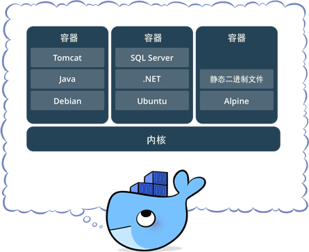

# 深入系统 docker 学习


## 安装

### macos 安装 docker

- 使用 Homebrew 安装
  ```
    brew -v
    sudo brew update
    brew cask install update
  ```

* 手动下载安装
  官网下载即可`https://docs.docker.com/docker-for-mac/install/`

### centos 安装 docker

- 搭建 centos 虚拟机
  - 下载`virtualbox`, 地址`https://www.virtualbox.org/wiki/Downloads`
  * 下载`vagrant`, 地址`https://www.vagrantup.com/downloads.html`

* 基于 vagrant 构建

  ```
    vagrant init centos/7
    vagrant up
    vagrant ssh
    sudo yum update
    exit
    vagrant status
    vagrant halt
    vagrant destroy
  ```

* 在 centos 上安装 docker

  ```
    $ sudo yum remove docker docker-client docker-client-latest docker-common docker-latest docker-latest-logrotate docker-logrotate docker-engine

    $ sudo yum install -y yum-utils device-mapper-persistent-data lvm2

    $ sudo yum-config-manager --add-repo https://download.docker.com/linux/centos/docker-ce.repo

    $ sudo yum install docker-ce docker-ce-cli containerd.io

    $ sudo systemctl start docker

    $ sudo docker run hello-world

  ```

## docker machine

- 使用 docker-machine 创建 virtualbox 虚拟机

  ```
    docker-machine version
    docker-machine create demo
    docker-machine ls
    docker-machine ssh demo
    docker-machine stop demo
    docker-machine env demo
    eval $(docker-machine env demo)
  ```

- 让 docker-machine 和阿里云搞 cp
  参考`https://github.com/AliyunContainerService/docker-machine-driver-aliyunecs`

## docker 底层



### docker platform

- docker 提供了一个开发，打包，运行 app 的平台
- 把 app 和底层 infrastructure 隔离开来


### docker engine

- 后台进程(dockerd)

- REST API Server

- CLI 接口(docker)


### docker architecture


### 底层技术支持

- Namespaces: 做隔离 pid,net,ipc,mnt,uts

* Control groups: 做资源限制

* Union file systems: Container 和 image 的分层

## docker image(镜像)

- 操作系统分为内核和用户空间。对于 Linux 而言，内核启动后，会挂载 root 文件系统为其提供用户空间支持。而 Docker 镜像（Image），就相当于是一个 root 文件系统。
- Docker 镜像是一个特殊的文件系统，除了提供容器运行时所需的程序、库、资源、配置等文件外，还包含了一些为运行时准备的一些配置参数（如匿名卷、环境变量、用户等）。 镜像不包含任何动态数据，其内容在构建之后也不会被改变。
- Docker 设计时，就充分利用 Union FS 的技术，将其设计为 分层存储的架构 。 镜像实际是由多层文件系统联合组成。
- 镜像构建时，会一层层构建，前一层是后一层的基础。每一层构建完就不会再发生改变，后一层上的任何改变只发生在自己这一层。

## docker container(容器)

- 镜像（Image）和容器（Container）的关系，就像是面向对象程序设计中的 类 和 实例 一样，镜像是静态的定义，容器是镜像运行时的实体。容器可以被创建、启动、停止、删除、暂停等 。
- 容器的实质是进程，但与直接在宿主执行的进程不同，容器进程运行于属于自己的独立的 命名空间。前面讲过镜像使用的是分层存储，容器也是如此。
- 容器存储层的生存周期和容器一样，容器消亡时，容器存储层也随之消亡。因此，任何保存于容器存储层的信息都会随容器删除而丢失。
- 按照 Docker 最佳实践的要求，容器不应该向其存储层内写入任何数据 ，容器存储层要保持无状态化。所有的文件写入操作，都应该使用数据卷（Volume）、或者绑定宿主目录，在这些位置的读写会跳过容器存储层，直接对宿主(或网络存储)发生读写，其性能和稳定性更高。数据卷的生存周期独立于容器，容器消亡，数据卷不会消亡。因此， 使用数据卷后，容器可以随意删除、重新 run ，数据却不会丢失。

## docker 仓库（Repository）

- 镜像构建完成后，可以很容易的在当前宿主上运行，但是， 如果需要在其它服务器上使用这个镜像，我们就需要一个集中的存储、分发镜像的服务，Docker Registry 就是这样的服务。
- 一个 Docker Registry 中可以包含多个仓库（Repository）；每个仓库可以包含多个标签（Tag）；每个标签对应一个镜像。所以说：镜像仓库是 Docker 用来集中存放镜像文件的地方类似于我们之前常用的代码仓库。
- 通常，一个仓库会包含同一个软件不同版本的镜像，而标签就常用于对应该软件的各个版本 。我们可以通过<仓库名>:<标签>的格式来指定具体是这个软件哪个版本的镜像。如果不给出标签，将以 latest 作为默认标签.。

这里补充一下`Docker Registry 公开服务`和`私有 Docker Registry`的概念：

- Docker Registry 公开服务 是开放给用户使用、允许用户管理镜像的 Registry 服务。一般这类公开服务允许用户免费上传、下载公开的镜像，并可能提供收费服务供用户管理私有镜像。
- 最常使用的 Registry 公开服务是官方的 Docker Hub ，这也是默认的 Registry，并拥有大量的高质量的官方镜像，网址为：hub.docker.com/ 。在国内访问 Docker Hub 可能会比较慢国内也有一些云服务商提供类似于 Docker Hub 的公开服务。比如 时速云镜像库、网易云镜像服务、DaoCloud 镜像市场、阿里云镜像库等。
- 除了使用公开服务外，用户还可以在 本地搭建私有 Docker Registry 。Docker 官方提供了 Docker Registry 镜像，可以直接使用做为私有 Registry 服务。开源的 Docker Registry 镜像只提供了 Docker Registry API 的服务端实现，足以支持 docker 命令，不影响使用。但不包含图形界面，以及镜像维护、用户管理、访问控制等高级功能。

## docker 常用指令

### 镜像操作

| 功能               | 命令                                          |
| ------------------ | :-------------------------------------------- |
| 拉取镜像           | docker pull [镜像名称:版本]                   |
| 镜像列表           | docker images                                 |
| 删除镜像           | docker rmi[镜像名称:版本]                     |
| 镜像操作记录       | docker history [镜像名称:版本]                |
| 给镜像设置新的仓库 | docker tag [镜像名称:版本][新镜像名称:新版本] |
| 查看镜像详细       | docker inspect [镜像名称:版本]                |
| 搜索镜像           | docker search [关键字]                        |
| 仓库登录           | docker login                                  |

### 容器操作

| 功能                  | 命令                                                                        |
| --------------------- | :-------------------------------------------------------------------------- |
| 启动容器并进入        | docker run -ti --name [容器名称][镜像名称:版本] bash                        |
| 容器列表              | docker ps -a                                                                |
| 容器提交为新的镜像    | docker commit [容器名称] my_image:v1.0                                      |
| 容器后台运行          | docker run -d --name [容器名称][镜像名称:版本] bash -c "echo hello world"   |
| 容器结束后自动删除    | docker run --rm --name [容器名称][镜像名称:版本] bash -c "echo hello world" |
| 删除容器              | docker rm [容器名称]                                                        |
| 进入容器 exec         | docker exec -ti [容器名称] bash                                             |
| 进入容器 attach       | docker attach [容器名称]                                                    |
| 停止容器              | docker stop [容器名称]                                                      |
| Docker 日志           | docker logs [容器名称]                                                      |
| 查看容器详细          | docker inspect [容器名称]                                                   |
| 查看容器最近一个进程  | docker top [容器名称]                                                       |
| docker top [容器名称] | docker restart [容器名称]                                                   |
| 暂停一个容器进程      | docker pause [容器名称]                                                     |
| 取消暂停              | docker unpause [容器名称]                                                   |
| 终止容器              | docker kill [容器名称]                                                      |
| 端口映射              | docker run -ti --name [容器名称] -p 8080:80 [镜像名称:版本] bash            |

### 内存限制

| 参数          | 简介                                                      |
| ------------- | :-------------------------------------------------------- |
| -m, - -memory | 内存限制，格式：数字+单位，单位可以是 b, k, m, g，最小 4M |

### CPU 限制

| 参数               | 简介              |
| ------------------ | :---------------- |
| -- -cpuset-cpus="" | 允许使用的 CPU 集 |
| -c,- -cpu-shares=0 | CPU 共享权值      |

### dockerfile 指令

| 命令       | 说明                     | 示例                                               |
| ---------- | :----------------------- | :------------------------------------------------- |
| FROM       | 基于这个 Image 开始      | FROM nginx:latest                                  |
| ENV        | 环境变量                 | ENV localfile /usr/local/nginx                     |
| RUN        | 新层中执行命令           | RUN /bin/bash -c 'source $HOME/.bashrc; echo $HOME |
| LABEL      | 设置 metadata            | LABEL version="1.0"                                |
| MAINTAINER | 维护者 (deprecated)      | maintainer="feng shuan<fengshuan95@gmail.com>"     |
| EXPOSE     | 声明容器监听端口         | EXPOSE 80 443                                      |
| ADD        | 添加文件                 | ADD ./dist \${foo}/html                            |
| COPY       | 复制文件                 | COPY ./dist \${foo}/html                           |
| ENTRYPOINT | 容器启动时执行指令       |                                                    |
| CMD        | 容器启动时执行指令默认值 | CMD ["-la"]                                        |
| WORKDIR    | 设置工作目录             | WORKDIR /path/to/workdir                           |
| VOLUME     | 挂载点                   | VOLUME ["/data"]                                   |
| USER       | 指定操作用户             | USER www                                           |
